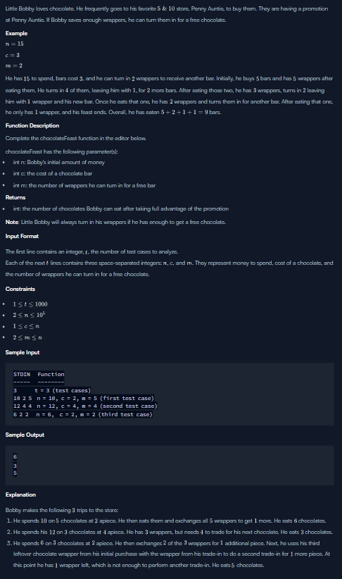

####
Today I've challenged myself to dive into hackerrank website wherein you solve a problem within the problem you choose since there is a tons of coding problems that you can solve. Here's the link if you wanted to solve also some coding problems : [Hackerrank_link](hackerrank.com)
####
Here's my solution to this problem:
```` kotlin
var result = n / c
var wrapper = result

    while (wrapper >= m) {
        val extraChocolate = wrapper / m
        result += extraChocolate
        wrapper = (wrapper % m) + extraChocolate
    }
    return result
````
To simplify this code. I just created variable called result which identify as the bought chocolate and I also have created a wrapper variable that gets the value of the result which is the chocolates that becomes wrapper. So, in this case I checked the wrapper if it is greater than or equal to m if it's true then it gets another extra chocolate if not then it won't enter the loop and return the result. I've created variable name extraChocolate that will claim the free chocolate, So I peform wrapper / m to get how many extra chocolate that we have then after that I added it into the result variable to calculates how many chocolates we get. Lastly, I've gather the wrapper of the free chocolate and also add the wrapper of the extra chocolate previously that is not applicable for free chocolate
####
Here's the link if you want to try the problem too : [Chocolate Feast](https://www.hackerrank.com/challenges/chocolate-feast/problem?isFullScreen=true)